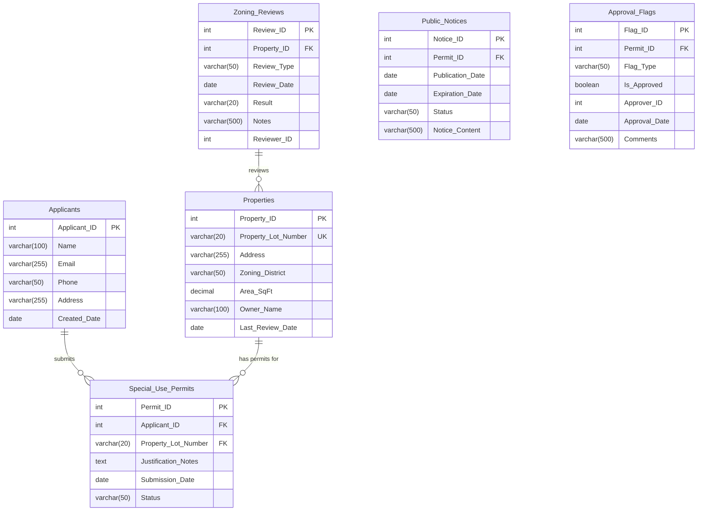

# Downtown Zoning Board - Database Entity Relationship Diagram

## Overview
Database schema for Downtown Zoning Board Review system including Special Use Permits tracking.

## Entity Relationship Diagram (Mermaid)



## Table Specifications

### Applicants
| Column | Type | Constraints | Description |
|--------|------|-------------|-------------|
| Applicant_ID | INT | PRIMARY KEY, AUTO_INCREMENT | Unique applicant identifier |
| Name | VARCHAR(100) | NOT NULL | Full legal name |
| Email | VARCHAR(255) | NOT NULL | Contact email |
| Phone | VARCHAR(50) | | Contact phone |
| Address | VARCHAR(255) | | Mailing address |
| Created_Date | DATE | DEFAULT CURRENT_DATE | Record creation date |

### Properties
| Column | Type | Constraints | Description |
|--------|------|-------------|-------------|
| Property_ID | INT | PRIMARY KEY, AUTO_INCREMENT | Unique property identifier |
| Property_Lot_Number | VARCHAR(20) | UNIQUE, NOT NULL | Official lot number |
| Address | VARCHAR(255) | NOT NULL | Physical address |
| Zoning_District | VARCHAR(50) | | Current zoning classification |
| Area_SqFt | DECIMAL(12,2) | | Property area in square feet |
| Owner_Name | VARCHAR(100) | | Legal owner name |
| Last_Review_Date | DATE | | Date of last zoning review |

### Zoning_Reviews
| Column | Type | Constraints | Description |
|--------|------|-------------|-------------|
| Review_ID | INT | PRIMARY KEY, AUTO_INCREMENT | Unique review identifier |
| Property_ID | INT | FOREIGN KEY → Properties | Reference to property |
| Review_Type | VARCHAR(50) | | Type of review conducted |
| Review_Date | DATE | | Date review was performed |
| Result | VARCHAR(20) | | APPROVED/DENIED/PENDING |
| Notes | VARCHAR(500) | | Review notes |
| Reviewer_ID | INT | | ID of reviewing official |

### Special_Use_Permits (NEW)
| Column | Type | Constraints | Description |
|--------|------|-------------|-------------|
| Permit_ID | INT | PRIMARY KEY, AUTO_INCREMENT | Unique permit identifier |
| Applicant_ID | INT | FOREIGN KEY → Applicants | Reference to applicant |
| Property_Lot_Number | VARCHAR(20) | FOREIGN KEY → Properties | Reference to property lot |
| Justification_Notes | TEXT | NOT NULL | Detailed justification for special use |
| Submission_Date | DATE | NOT NULL | Date application submitted |
| Status | VARCHAR(50) | DEFAULT 'PENDING' | PENDING/UNDER_REVIEW/APPROVED/DENIED |

### Public_Notices (Supporting Table)
| Column | Type | Constraints | Description |
|--------|------|-------------|-------------|
| Notice_ID | INT | PRIMARY KEY, AUTO_INCREMENT | Unique notice identifier |
| Permit_ID | INT | FOREIGN KEY → Special_Use_Permits | Reference to permit |
| Publication_Date | DATE | NOT NULL | Date notice was published |
| Expiration_Date | DATE | NOT NULL | Date notice period expires |
| Status | VARCHAR(50) | | ACTIVE/EXPIRED/CLOSED |
| Notice_Content | VARCHAR(500) | | Content of public notice |

### Approval_Flags (Supporting Table)
| Column | Type | Constraints | Description |
|--------|------|-------------|-------------|
| Flag_ID | INT | PRIMARY KEY, AUTO_INCREMENT | Unique flag identifier |
| Permit_ID | INT | FOREIGN KEY → Special_Use_Permits | Reference to permit |
| Flag_Type | VARCHAR(50) | | SENIOR_PLANNER/BOARD_REVIEW/etc |
| Is_Approved | BOOLEAN | DEFAULT FALSE | Approval status |
| Approver_ID | INT | | ID of approving official |
| Approval_Date | DATE | | Date of approval |
| Comments | VARCHAR(500) | | Approval comments |

## Relationships

1. **Applicants → Special_Use_Permits**: One-to-Many
   - An applicant can submit multiple special use permits
   - Each permit must have exactly one applicant

2. **Properties → Special_Use_Permits**: One-to-Many
   - A property can have multiple special use permits
   - Each permit references exactly one property lot

3. **Zoning_Reviews → Properties**: One-to-Many
   - Multiple reviews can be conducted on a property
   - Reviews track zoning compliance history

4. **Special_Use_Permits → Public_Notices**: One-to-Many
   - Each permit may have multiple public notices
   - Required for transparency and public comment period

5. **Special_Use_Permits → Approval_Flags**: One-to-Many
   - Each permit requires multiple approval flags
   - Tracks multi-stage approval workflow

## Indexes

```sql
CREATE INDEX idx_permits_applicant ON Special_Use_Permits(Applicant_ID);
CREATE INDEX idx_permits_property ON Special_Use_Permits(Property_Lot_Number);
CREATE INDEX idx_permits_status ON Special_Use_Permits(Status);
CREATE INDEX idx_permits_submission ON Special_Use_Permits(Submission_Date);
CREATE INDEX idx_notices_permit ON Public_Notices(Permit_ID);
CREATE INDEX idx_notices_status ON Public_Notices(Status);
CREATE INDEX idx_flags_permit ON Approval_Flags(Permit_ID);
CREATE INDEX idx_flags_approved ON Approval_Flags(Is_Approved);
```

---
*Generated: 2026-03-29*
*Downtown Zoning Board Review System*
